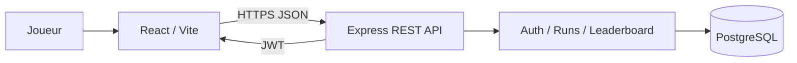

# RUN — projet fil rouge M2 INFO

Prototype full-stack d'un jeu de course 2D : inscription, authentification JWT, enregistrement des parties, historique et classement.

## Stack

- Front : React + Vite
- Back : Node.js + Express
- Données : PostgreSQL + Prisma
- Sécurité : JWT, bcrypt, validation Zod, Helmet, CORS
- Infra : Docker Compose

## Démarrage

```bash
cp .env.example .env
docker compose up -d db
npm install
npm run prisma:generate
npm run prisma:migrate
npm run prisma:seed
npm run dev
```

Front : http://localhost:5173 — API : http://localhost:3000

## Routes principales

- `POST /api/auth/register`
- `POST /api/auth/login`
- `GET /api/players/me` (JWT)
- `POST /api/runs` (JWT)
- `GET /api/runs/me` (JWT)
- `GET /api/leaderboard`
- `GET /api/health`

## Livrables pédagogiques

Les documents des activités 1 à 10 se trouvent dans `docs/`.

## Architecture



## Statut

Socle fonctionnel préparé sur la branche `running-game-fil-rouge`. Les mesures Lighthouse et les résultats de playtest devront être remplacés par des valeurs réelles après exécution locale.